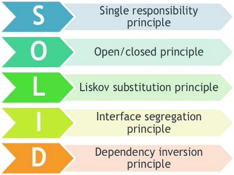

# C# - Aplicando Princípios SOLID na prática 

	

Aprendendo o que são e como aplicar os princípios SOLID na prática usando a linguagem C# bem como a usar os principais conceitos da programação orientada a objetos para ter o um **código limpo**.

## 🚀 Primeiro Módulo:
 Conceitos básicos da POO como classes, objetos, métodos, propriedades e herança.

## 🚀 Segundo Módulo:
Conceitos de Diagrama de classes, UML, herança, composição agregação, interfaces, classes abstratas e polimorfismo.

## 🚀 Terceiro Módulo:
Princípios SOLID, o que são, como atuam , como identificar e como aplicar os princípios para corrigir problemas no seu código.

#### Cada módulo, além de exemplos práticos possui exercícios propostos e resolvidos para que o conteúdo seja assimilado.

## 📖 Informações

### - O que você aprenderá
Entender e aplicar os princípios SOLID e os conceitos do paradigma da orientação a objetos na prática usando a linguagem C#
### - Há algum requisito ou pré-requisito para o curso?
Ter um conhecimento mínimo da linguagem C# e sua sintaxe e de seu funcionamento e um conhecimento básico de lógica de programação. Possuir um ambiente que suporte o Visual Studio 2019 ou o VS Code e com acesso a internet.
###  - Para quem é este curso:
Estudantes da área de TI, profissionais que desejam conhecer o paradigma OOP na linguagem C# , desenvolvedores que desejam reciclar o seu conhecimento e aprender como usar os conceitos da programação orientada a objetos.
